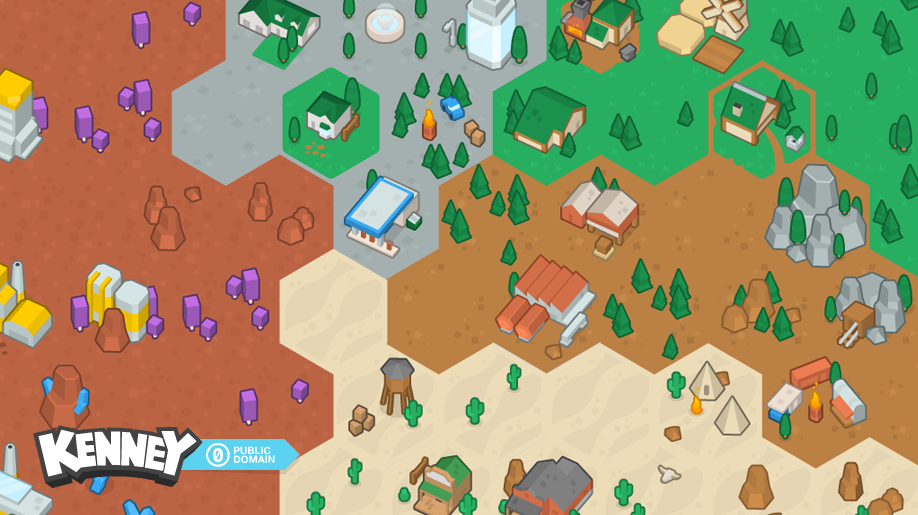

# Hexagon Pack

This package contains all hexagonal tiles from 
[Kenneys Hexagonal Pack](https://kenney.nl/assets/hexagon-pack). The tiles are distributed as individual
SVGs and PNGs in various sizes. 

The tiles were originally distributed in small PNGs
and SVG Spritesheet only, I have compiled the large
PNGs images by myself. Some unfortunately have some weird
artifacts, which however are not as visible anymore when scaling them down.

I have not created any of the tiles by myself, they
were all created by [Kenney](https://kenney.nl).

## Installing

The assets are distributed as NPM package. Install them
to your project with

    npm i kenney-hexagon-pack

## Directory structure

All tiles are in the ``assets/`` directory, seperated
by file type and size in subdirectories. The structure
looks like this:

 * assets/
   * 0.5x/
     * tile{id}@0.5x.png
   * 0.75x/
     * tile{id}@0.75x.png
   * 1x/
     * tile{id}@1x.png
   * 1.5x/
     * tile{id}@1.5x.png
   * 2x/
     * tile{id}@2x.png
   * 3x/
     * tile{id}@3x.png
   * 4x/
     * tile{id}@4x.png
   * SVG/
     * tile{id}.svg
   * spritesheets/
     * various spritesheet assets, unmodified 
       from original pack.